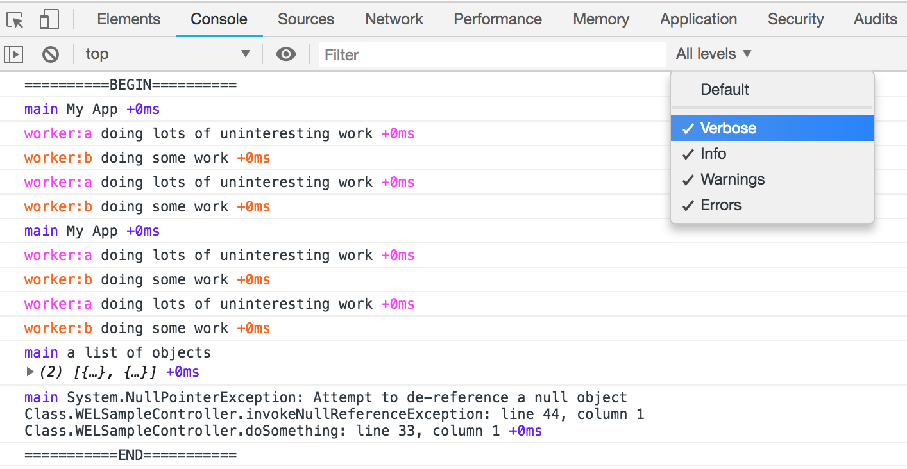
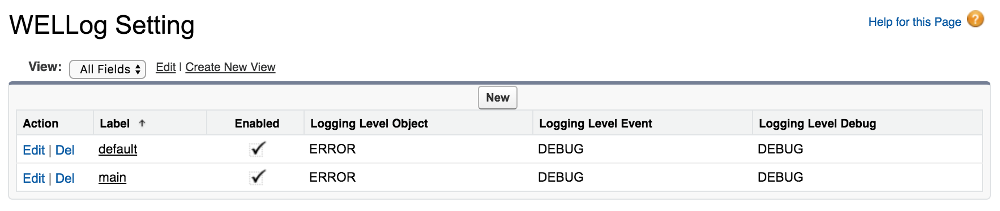

# Well Logger

WELLogger is a thin wrapper around Salesforce Apex `System.debug`. It aims to pretty format objects for classes such as Exception, and HttpResponse etc automatically.
```java
System.debug(ex.getMessage() + ': ' + ex.getStackTrackMessage()); // no more this
WELLogger.debug(ex); // just do this
```
In addition, it also has the following features:
1. Output logs to database sObject `WELLog__c`.
2. Output logs to `WELLogger.logs` array, which can be further exposed to external APIs.
3. Categorize logs by namespaces, i.e. `module_name:feature_name:modifier`.
4. Control logging levels for database, debug log, and web outputs by namespaces.

Below is a web browser output example. `[sample:controller]` is the namespace of the log. It is used to provide richer context of the log message.



## Installation

There are two ways to deploy them into your organization:

#### 1. Ant Migration Tool

This is the most common way if you are not familiar with `sfdx-cli`. Upload all source codes under directory `dist` by any tool/IDE supporting the file structure understandable by [Ant Migration Tool](https://developer.salesforce.com/docs/atlas.en-us.daas.meta/daas/meta_development.htm). Here are steps for how to upload them via workbench:

1. Download the source code
2. Zip the `dist` folder
3. Login into [workbench](https://workbench.developerforce.com)
4. Choose `migration -> Deploy` to upload the zip file

#### 2. SFDX-CLI or VS Code

If you are familiar with `sfdx-cli`, you can upload all source codes under directory `src-force/logger` to your organization via sfdx-cli or VS Code. Because the library is developed with VS Code [Salesforce CLI Integration](https://marketplace.visualstudio.com/items?itemName=salesforce.salesforcedx-vscode-core) extension.

1. Download the source code
2. Open VS Code with sfdx-cli right configured
3. Issue command `SFDX: Authorize an Org` for your organization
4. Right click the directory `src-force/logger` and issue command `SFDX: Deploy Source to Org`

## Usage

Its usage is as simple as `System.debug`.

```java
WELLogger.debug('doing some work');
WELLogger.debug(ex);
WELLogger.debug(LoggingLevel.DEBUG, 'doing some work');
WELLogger.debug(LoggingLevel.Error, ex);
```
And two additional APIs are provided for convinience.
```java
WELLogger.debug('error description', ex);
WELLogger.debug(LoggingLevel.Error, 'error description', ex);
```

When used in above way, all logs will be default to the `main` namespace implicitly. To define loggers with custom namespaces i.e. `module_name:feature_name:modifier`, please use the `WELLogger.get()` API as below. If a custom module doesn't have a corresponding WELLog Setting, the `default` setting will be applied. We will talk more about namespaces and settings in the next section.

```java
// WELLogger.ILogger and WELLogger.LoggerInterface can be used interchangeably
WELLogger.ILogger logger = WELLogger.get('module_name:feature_name:modifier');
logger.debug(ex);
logger.debug(LoggingLevel.ERROR, ex);
logger.debug(LoggingLevel.Error, 'error description', ex);
```

Logger namespace can be chained to create new loggers in other namespaces.

```java
WELLogger.ILogger logger = WELLogger.get('module_name'); // namespace = 'module_name'
logger = logger.get('feature_name'); // namespace = 'module_name:feature_name'
logger = logger.get('modifier'); // namespace = 'module_name:feature_name:modifier'
```

### Namespaces

Each log must have a namespace. A namespace should generally follow a pattern like `module_name:feature_name:modifier`.

| Namespace Part | Description                                                  |
| -------------- | ------------------------------------------------------------ |
| Module Name    | **Required**. Module name should be short and descriptive words. |
| Feature Name   | **Optional**. Feature name could be a short functional description, a class name, or the artchitecture layer etc. |
| Modifier       | **Optional**. Supplement to the feature name to further classify the log contexts. Is it an exception? How severe is it? |

However, new good namespace pattern can always be invented to suit your project needs. `module_name:class_name` might not be a good alternative, but it is useful and straightforward in some circumstances. Once formula fields created to parse the namespace context out, we can use them to generate much meaningful reports. 

#### Module Logging Levels
Use  `WELLogSetting__mdt` custom metadata type to control logging levels for each module. There are two built-in modules `main` and `default`. Their usage has been explained in the above section.



| Field Name        | Description                                                  |
| ----------------- | ------------------------------------------------------------ |
| Label             | A module name, the first name appeared in the namespace.     |
| Enabled           | Toggle the logs output for an entire module.                 |
| Logging Level *** | Controls the logging level for each of the three output types. |

### Logging Outputs

The library supports three output types:

| Output   | Description                                                  | Best Practice                                                |
| -------- | ------------------------------------------------------------ | ------------------------------------------------------------ |
| Database | Persist logs into sObject `WELLog__c`, after calling `WELLogger.save()` method. | Only enable this output for critical issues and exceptions.  |
| Debug    | Persist logs into the standard system debug logs.            | Main debug methodology, use this for daily development debugging activities as well as production debug, and performance tuning etc. |
| API      | Logs will not be persisted. Pull logs when needed from `WELLogger.logs`. | It is useful when logs can be viewed externally. It won't impact the 250MB debug log size limit, if APIs are called frequently and a lot of data/messages are carried with logs. **Note**: This should be turned off on production, unless another level of security is built on top of this library. |

#### Database Output

Here is the best approach for how to use `WELLogger.save()` to save logs into the database. Please limit this `try catch finally` pattern only to the entrance method of the current excecution context, i.e. `execute()` method for batch classes.

```java
public class WELSampleController {
    // WELLogger.ILogger and WELLogger.LoggerInterface can be used interchangeably
    static WELLogger.ILogger logger = WELLogger.get('sample:controller');
    
    class Response {
        Object data { get; set; }
        Object logs { get; set; }
    }
    
    @RemoteAction
    public static Response doSomeWork(String param1, Decimal param2) {
        logger.debug('[M:E] doSomeWork()'); // log for method enter
        logger.debug('[P:param1]', param1); // log for parameter
        logger.debug('[P:param2]', param2); // log for parameter

        Response res = new Response();
        try {
            logger.debug(LoggingLevel.INFO, 'doing lots of uninteresting work');
            logger.debug(LoggingLevel.WARN, 'doing some work');
            logger.debug(LoggingLevel.INFO, 'doing lots of uninteresting work');
            logger.debug(LoggingLevel.WARN, 'doing some work');
            logger.debug('a list of objects', new List<Object>());
        } catch (DmlException ex) {
            logger.get('ex').debug(LoggingLevel.ERROR, ex); // use ex as modifier
        } catch(Exception ex) {
            logger.get('ex').debug(LoggingLevel.ERROR, ex); // use ex as modifier
        } finally {
            WELLogger.save();          // output to database
            res.logs = WELLogger.logs; // output to browser
        }

        logger.debug('[M:X] doSomeWork()'); // log for method exit
        return res;
    }
}
```

#### Browser Output 

In the above example we can also see a log output to the remote action response. We can print these logs in the developer console with wellogger.js helper. To view the logs in Chrome developer console, select `Verbose` as the logging level. Source codes for both remote action and lightning component are under the directory `src-force/sample`.

```html
<apex:page name="WELSample" controller="WELSampleController">
  <apex:includeScript value="{!URLFOR($Resource.WELLogger, 'wellogger.js')}"/>
  <script>
    Visualforce.remoting.Manager.invokeAction(
      '{!$RemoteAction.WELSampleController.doSomeWork}', 'value 1', 'value 2',
      function(result, event){
        if (event.status) {
          wellogger(result.logs);
        }
      },
      {escape: true}
    );
  </script>
</apex:page>
```

## License
MIT License

Copyright (c) 2019 Jianfeng Jin

Permission is hereby granted, free of charge, to any person obtaining a copy
of this software and associated documentation files (the "Software"), to deal
in the Software without restriction, including without limitation the rights
to use, copy, modify, merge, publish, distribute, sublicense, and/or sell
copies of the Software, and to permit persons to whom the Software is
furnished to do so, subject to the following conditions:

The above copyright notice and this permission notice shall be included in all
copies or substantial portions of the Software.

THE SOFTWARE IS PROVIDED "AS IS", WITHOUT WARRANTY OF ANY KIND, EXPRESS OR
IMPLIED, INCLUDING BUT NOT LIMITED TO THE WARRANTIES OF MERCHANTABILITY,
FITNESS FOR A PARTICULAR PURPOSE AND NONINFRINGEMENT. IN NO EVENT SHALL THE
AUTHORS OR COPYRIGHT HOLDERS BE LIABLE FOR ANY CLAIM, DAMAGES OR OTHER
LIABILITY, WHETHER IN AN ACTION OF CONTRACT, TORT OR OTHERWISE, ARISING FROM,
OUT OF OR IN CONNECTION WITH THE SOFTWARE OR THE USE OR OTHER DEALINGS IN THE
SOFTWARE.

