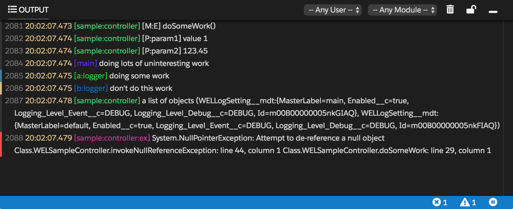

# Well Logger


WELLogger is a thin wrapper around Salesforce Apex `System.debug`. It aims to pretty format objects for classes such as Exception, and HttpResponse etc automatically.

```java
System.debug(ex.getMessage() + ': ' + ex.getStackTrackMessage()); // no more this
WELLogger.debug(ex); // just do this
```
In addition, it also has the following features:
1. Add two new log outputs:
   - Output as database sObject `WELLog__c` for long time persistence of crucial logs.
   - Output as platform event `WELLogEvent__e` for live debugging.
2. Categorize logs by namespaces to provide richer context, i.e. `module_name:feature_name:modifier`.
3. Control logging levels for *database*, *platform event*, and *system debug* outputs via namespaces.

Below is a platform event output terminal, which is a lightening web component (LWC) in its maximized state. `[sample:controller]` is a namespace.



## Installation

Before doing any installation, please pay attention to the following two directories:

1. `src\logger` - **Required***, this is the core library. It can be deployed standalone if you don't want to output logs as platform events, or your org doesn't support it.
2. `src\terminal` - **Optional***, deploy this together with the `src\logger` if you also want to get some benefits from the platform event output terminal.

#### 1. Ant Migration Tool

This is the most common way if you are not familiar with `sfdx-cli`. Upload all source codes under directory `dist\logger` or `dist\terminal` by any tool/IDE supporting the file structure understandable by [Ant Migration Tool](https://developer.salesforce.com/docs/atlas.en-us.daas.meta/daas/meta_development.htm). Here are steps for how to upload them via workbench:

1. Download the source code
2. Zip the `dist\logger` or `dist\terminal` folder
3. Login into [workbench](https://workbench.developerforce.com)
4. Choose `migration -> Deploy` to upload the zip file

#### 2. SFDX-CLI or VS Code

If you are familiar with `sfdx-cli`, you can upload all source codes under directory `src\logger` or `src\terminal` to your organization via sfdx-cli or VS Code. The library is developed under VS Code [Salesforce Extension Pack](https://marketplace.visualstudio.com/items?itemName=salesforce.salesforcedx-vscode) extension.

1. Download the source code
2. Open VS Code with sfdx-cli right configured
3. Issue command `SFDX: Authorize an Org` for your organization
4. Right click the directory `src\logger` or `src\terminal` and issue command `SFDX: Deploy Source to Org`

#### 3. LWC Terminal

Ideally in App Builder create a single colum layout. Embed the WELLogViewer component and choose a height, you will be good to go.

## Usage

Its usage is as simple as `System.debug` with same APIs.

```java
WELLogger.debug('doing some work');
WELLogger.debug(ex);
WELLogger.debug(LoggingLevel.DEBUG, 'doing some work');
WELLogger.debug(LoggingLevel.Error, ex);
```
And two additional APIs are provided for convinience.
```java
WELLogger.debug('error description', ex);
WELLogger.debug(LoggingLevel.Error, 'error description', ex);
```

When `debug` is called as a static method, all logs will be default to a `main` namespace implicitly. To define loggers with custom namespaces i.e. `module_name:feature_name:modifier`, please use the `WELLogger.get()` API as below.

```java
// WELLogger.ILogger and WELLogger.LoggerInterface can be used interchangeably
WELLogger.ILogger logger = WELLogger.get('module_name:feature_name:modifier');
logger.debug(ex);
logger.debug(LoggingLevel.ERROR, ex);
logger.debug(LoggingLevel.Error, 'error description', ex);
```

Namespaces can be chained to create loggers in new namespaces.

```java
WELLogger.ILogger logger = WELLogger.get('module_name'); // namespace = 'module_name'
logger = logger.get('feature_name'); // namespace = 'module_name:feature_name'
logger = logger.get('modifier'); // namespace = 'module_name:feature_name:modifier'
```

All log outputs are controlled by the WELLog Setting of each module. If the module of a custom namespace doesn't have a corresponding WELLog Setting, the `default` WELLog Setting will be applied. We will talk more about namespaces and settings in the next section.

### Namespaces

Each log must have a namespace. A namespace should generally follow a pattern like `module_name:feature_name:modifier`.

| Namespace Part | Description                                                  |
| -------------- | ------------------------------------------------------------ |
| Module Name    | **Required**. Module name should be short and descriptive words. |
| Feature Name   | **Optional**. Feature name could be a short functional description, a class name, or the artchitecture layer etc. |
| Modifier       | **Optional**. Supplement to the feature name to further classify the log contexts. For example, it can be used to identify an exception or the log severity etc. |

However, new good namespace patterns can always be invented to suit your project needs. Some may not be good alternatives, but they could be useful and straightforward in some circumstances. With the help of formula fields to parse the namespaces, we can generate much meaningful reports.

#### Module Logging Levels
Use  `WELLogSetting__mdt` custom metadata type to control logging levels for each module. There are two built-in modules `main` and `default`. Their usage has been explained in the above section.


| Field Name        | Description                                                  |
| ----------------- | ------------------------------------------------------------ |
| Label             | A module name, the first name appeared in the namespace.     |
| Enabled           | Toggle the logs output for an entire module.                 |
| Logging Level *** | Controls the logging level for each of the three output types. |

### Logging Outputs

The library supports three output types:

| Output     | Description                                        | Best Practice                                                |
| ---------- | -------------------------------------------------- | ------------------------------------------------------------ |
| **Object** | Persist logs into sObject `WELLog__c`.             | Only enable this output for critical issues and exceptions.  |
| **Event**  | Persist logs into platform event `WELLogEvent__e`. | Use this for Apex level debugging activities during developement phase. It won't impact the 250MB debug log size limit. Since platform event has a daily limit, to avoid generate too much on production, please set it to a strict logging level, or temporarily raise the level in a specific time window. |
| **Debug**  | Persist logs into the standard system debug.       | Use this for more advanced debugging activities especially to view logs not controlled by Apex `System.debug`. Such as SOQL statement and performance tuning etc. |

#### Logging Paradigm

Here is the best approach for how to use `WELLogger.save()` to save logs as sObjects and publish as platform events. Please limit this `try catch finally` pattern only to the entrance method of the current excecution context, i.e. `execute()` method for batch classes.

```java
public class WELSampleController {
    // WELLogger.ILogger and WELLogger.LoggerInterface can be used interchangeably
    static WELLogger.ILogger logger = WELLogger.get('sample:controller');
    
    class Response {
        Object data { get; set; }
    }
    
    @RemoteAction
    public static Response doSomeWork(String param1, Decimal param2) {
        logger.debug('[M:E] doSomeWork()'); // log for method enter
        logger.debug('[P:param1]', param1); // log for parameter
        logger.debug('[P:param2]', param2); // log for parameter

        Response res = new Response();
        try {
            logger.debug(LoggingLevel.INFO, 'doing lots of uninteresting work');
            logger.debug('a list of objects', new List<Object>());
        } catch(Exception ex) {
            logger.get('ex').debug(LoggingLevel.ERROR, ex); // use ex as modifier
        } finally {
            WELLogger.save(); // output to database
        }

        logger.debug('[M:X] doSomeWork()'); // log for method exit
        logger.debug('[R:res]', res);       // log for return value
        return res;
    }
}
```

## License
MIT

